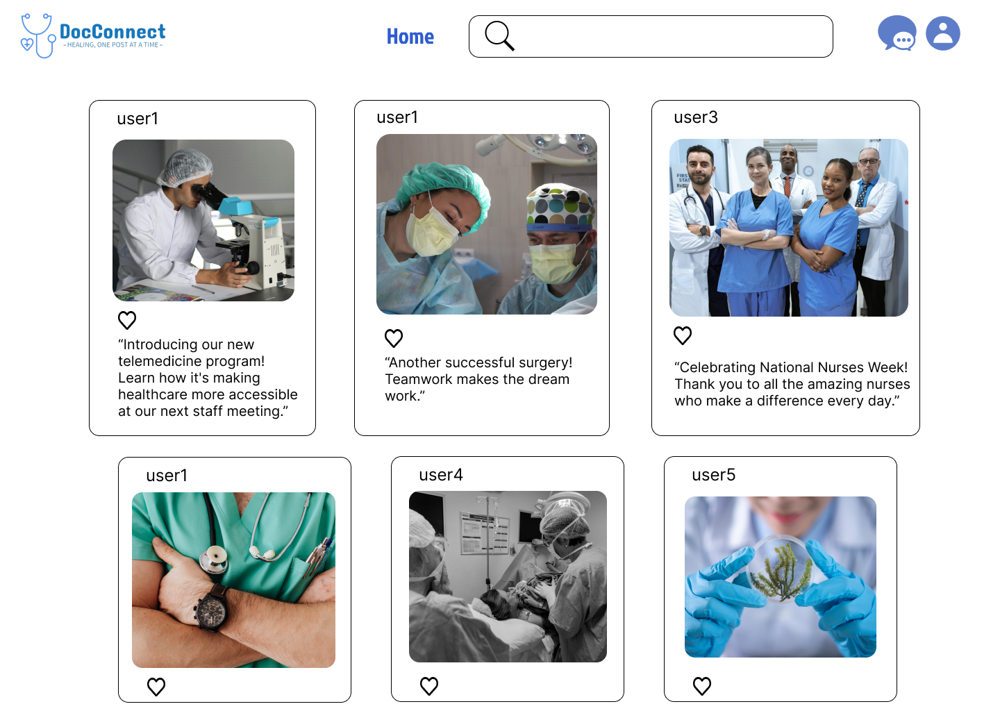

# DocConnect
Welcome to DocConnect, a social media application designed exclusively for the employees of a hospital. This platform aims to foster a sense of community, collaboration, and communication among the dedicated healthcare professionals working tirelessly to enhance patient care.  
With this app, all employees whether they're doctors, nurses, technicians, EMT professionals, pharmacists, administrative staff or any other employee can access this application to update themselves about the happenings at their workplace. They can communicate with each other and share about their work life as well.

## Features:

- Profile and Bio
- Posts and feed
- Messaging and group discussions
- File sharing
- Hashtags for filtering
- Likes, reactions and comments
- Pinned posts

## Server
[API Documentation](https://documenter.getpostman.com/view/32312306/2s9YymFjCc#c60f9810-efda-4152-9a38-f4448c64c4e7)

## Design

